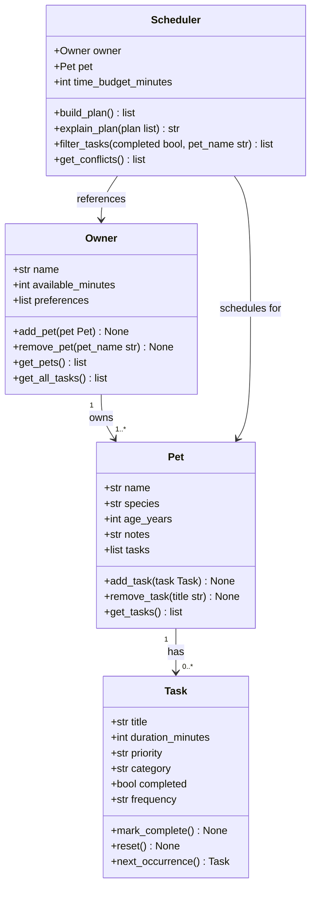

```mermaid
classDiagram
    class Owner {
        +str name
        +int available_minutes
        +list preferences
        +add_pet(pet Pet) None
        +remove_pet(pet_name str) None
        +get_pets() list
        +get_all_tasks() list
    }
    class Pet {
        +str name
        +str species
        +int age_years
        +str notes
        +list tasks
        +add_task(task Task) None
        +remove_task(title str) None
        +get_tasks() list
    }
    class Task {
        +str title
        +int duration_minutes
        +str priority
        +str category
        +bool completed
        +str frequency
        +mark_complete() None
        +reset() None
        +next_occurrence() Task
    }
    class Scheduler {
        +Owner owner
        +Pet pet
        +int time_budget_minutes
        +build_plan() list
        +explain_plan(plan list) str
        +filter_tasks(completed bool, pet_name str) list
        +get_conflicts() list
    }

    Owner "1" --> "1..*" Pet : owns
    Pet  "1" --> "0..*" Task : has
    Scheduler --> Owner : references
    Scheduler --> Pet  : schedules for
```
